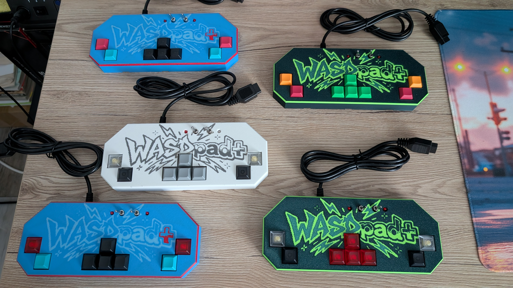
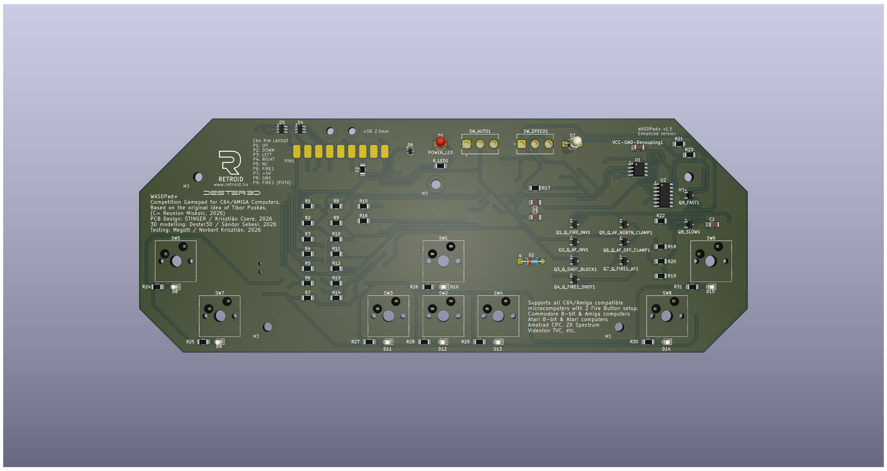
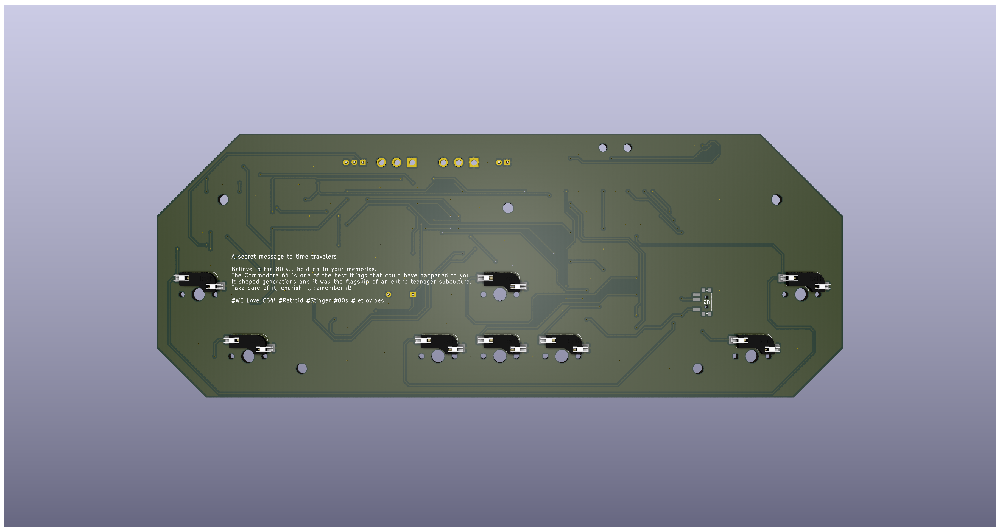
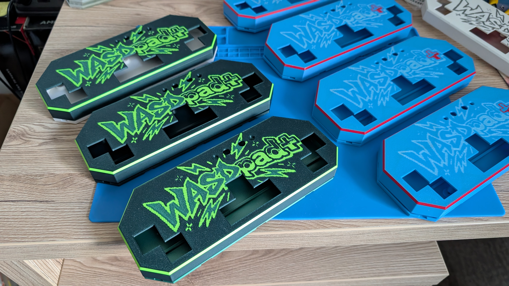

# WASDPad+

### Hardware WASD-style game controller for Commodore 64, Amiga and compatible retro computers

**Current Hardware:** Rev1.5.1  
**Status:** Production Release Candidate  
**Architecture:** Pure hardware — no MCU, firmware or drivers  
**Last Updated:** 2026-08-29

<p align="center">
  
</p>

<p align="center">
  <em>WASDPad+ — mechanical-switch game controllers built for classic computers.</em>
</p>

---

## Modern controls. Original hardware.

**WASDPad+** is a custom hardware game controller designed for classic computers using the traditional Atari-style digital joystick interface.

It combines the familiar precision of a keyboard-style WASD layout with an electrical architecture designed specifically for original retro hardware.

No USB conversion.  
No Bluetooth.  
No firmware.  
No software driver.  
No input polling.

**Just switches, discrete hardware and the original computer.**

The current **Rev1.5.1** hardware is the production-oriented evolution of the WASDPad platform. It adds MX hot-swap support, hardware autofire, electrical protection, dual-colour status indication and subtle key backlighting while retaining a direct, deterministic hardware signal path.

---

# Why WASDPad?

Classic joystick games were built around digital inputs:

```text
UP
DOWN
LEFT
RIGHT
FIRE
```

Traditional joysticks translate these inputs through movement of a physical stick.

WASDPad takes a different approach.

The directional controls are individual mechanical keys arranged in a familiar keyboard-style layout. The result combines retro-computer electrical compatibility with the fast, precise feel of mechanical keyboard switches.

The controller does not emulate a joystick through software.

**Electrically, it is the joystick.**

---

# Rev1.5.1 Highlights

## Eight Mechanical Gameplay Switches

Rev1.5.1 provides eight primary gameplay controls:

```text
UP
DOWN
LEFT
RIGHT

FIRE1 LEFT
FIRE1 RIGHT

FIRE2 LEFT
FIRE2 RIGHT
```

The duplicated FIRE1 and FIRE2 controls create an ambidextrous layout.

---

## MX Hot-Swap

All eight gameplay switches use **Kailh MX-compatible hot-swap sockets**.

The production configuration uses **Gateron KS-8 Yellow** mechanical switches.

Switches can be replaced without soldering, making it possible to:

- replace worn switches
- experiment with different compatible switch types
- customize switch feel
- service the controller without PCB rework

---

## Hardware Autofire

FIRE1 includes a completely hardware-generated autofire system.

Two fixed autofire rates are available:

| Mode | Timing Resistance |
|---|---:|
| SLOW | 680 kΩ |
| FAST | 330 kΩ |

Physical selector orientation:

```text
LEFT  -> SLOW
RIGHT -> FAST
```

Autofire can be independently enabled or disabled.

When disabled, FIRE1 behaves as a conventional joystick fire button.

There is no firmware involved in generating the autofire pulses.

---

## Dual-Colour Autofire Status

A dedicated red/green LED provides visual feedback for the autofire system.

A separate red LED provides controller power indication.

The indication circuitry is separate from the primary gameplay signal path.

---

## Warm-White Key Backlighting

Rev1.5.1 introduces subtle illumination beneath all eight gameplay switches.

Each key has an independently current-limited warm-white LED. The system is intentionally designed for restrained, functional illumination rather than high-brightness decorative lighting.

A dedicated hardware switch allows the entire backlight system to be turned on or off independently from controller operation.

---

# Rev1.5.1 PCB

Rev1.5.1 represents the production-oriented evolution of the WASDPad discrete-hardware architecture.

<p align="center">
  
  
</p>

<p align="center">
  <em>WASDPad+ Rev1.5.1 production-candidate PCB — front and rear views.</em>
</p>

The PCB combines the gameplay interface, autofire generator, output switching, status indication, power protection and backlight control in a single two-layer design.

Rev1.5.1 uses a mixed assembly model with SMD electronics, THT user-interface components, bottom-side MX hot-swap sockets and manually installed mechanical components.

---

# Electrical Protection

Original retro computers were not designed around modern ESD and hot-plugging expectations.

Rev1.5.1 therefore adds dedicated protection between the external controller environment and the host computer.

Protection includes:

- resettable +5 V overcurrent protection
- ESD protection on externally accessible joystick signals
- transient protection on the +5 V supply
- local supply decoupling
- GND copper zones on both PCB layers
- GND stitching vias

These functions operate automatically and require no user configuration.

---

# Direct Retro Hardware Interface

WASDPad+ does not insert a digital protocol between the player and the computer.

For normal manual inputs:

```text
Mechanical Switch
       │
       ▼
Hardware Signal Path
       │
       ▼
Host Joystick Input
```

There is no:

- USB polling interval
- wireless transmission
- firmware input scan
- operating-system driver
- software translation
- protocol conversion

This keeps the architecture deterministic and particularly suitable for latency-sensitive retro gaming.

---

# FIRE1 and FIRE2

Rev1.5.1 provides two independent fire functions.

### FIRE1

DE-9 pin 6.

Supports:

- manual fire
- hardware autofire

### FIRE2

DE-9 pin 9 / POTX.

Supports:

- independent manual second-fire input

FIRE2 functionality depends on the target computer and software.

Autofire applies to **FIRE1 only** in Rev1.5.1.

---

# DE-9 Interface

The controller follows the classic digital joystick interface architecture.

| DE-9 Pin | Function |
|---:|---|
| 1 | UP |
| 2 | DOWN |
| 3 | LEFT |
| 4 | RIGHT |
| 5 | Auxiliary / unused in current cable assembly |
| 6 | FIRE1 |
| 7 | +5 V |
| 8 | GND |
| 9 | FIRE2 / POTX |

The electrical pin number is authoritative.

Cable conductor colours are not considered authoritative because they may vary between manufacturing batches.

---

# Target Platforms

Primary development targets are:

- **Commodore 64**
- **Commodore 128**
- **Commodore Amiga**

The architecture may also work with other systems using electrically compatible Atari-style digital joystick interfaces.

Compatibility must be evaluated electrically — connector shape alone does not guarantee compatibility.

The Commodore Plus/4 family can be supported through an appropriate passive pin-mapping adapter.

---

# Hardware-Only by Design

Rev1.5.1 deliberately does **not** contain a microcontroller.

That is not an accidentally missing feature. It is part of the design philosophy.

The current generation prioritizes:

- deterministic behaviour
- low latency
- simplicity
- repairability
- low power consumption
- compatibility with vintage hardware
- understandable electronics
- long-term serviceability

There is no programmed component required for normal controller operation.

---

# Designed as a Complete Controller

<p align="center">
  
</p>

WASDPad+ is developed as a complete controller platform rather than only as an electronic circuit.

The project includes:

- custom PCB electronics
- component selection
- mechanical switch layout
- custom enclosure design
- 3D-printed enclosure production
- assembly planning
- manufacturing documentation
- validation procedures

The enclosure and PCB are developed together so that switch position, user controls, status indicators, cable routing and serviceability form one integrated design.

---

# PCB and Manufacturing Engineering

Rev1.5.1 has completed its principal pre-production engineering stages.

The PCB design includes:

- two-layer construction
- GND copper zones on both layers
- GND stitching vias
- SMD logic and protection electronics
- bottom-mounted MX hot-swap sockets
- bottom-mounted backlight control
- THT user-interface components
- direct controller-cable connection
- mixed automated/manual assembly

Engineering checks completed:

```text
Schematic Review                 PASS
ERC                              PASS
PCB Layout Review                PASS
DRC                              PASS
Critical Pinout Review           PASS
Protection Topology Review       PASS
Assembly Orientation Review      PASS
Gerber Generation                COMPLETE
Master BOM                       COMPLETE
Master CPL                       COMPLETE
Manufacturing Documentation      COMPLETE
```

---

# Current Release Status

## WASDPad+ Rev1.5.1

**Production Release Candidate**

The Rev1.5.1 design is frozen for production-candidate manufacture.

Completed:

- [x] hardware architecture
- [x] schematic
- [x] component selection
- [x] PCB layout
- [x] electrical protection
- [x] hardware autofire
- [x] hot-swap architecture
- [x] status indication
- [x] key backlighting
- [x] ERC
- [x] DRC
- [x] critical pinout validation
- [x] protection topology validation
- [x] assembly orientation review
- [x] Gerber generation
- [x] Master BOM
- [x] Master CPL
- [x] datasheet traceability
- [x] alternate-part policy
- [x] procurement documentation
- [x] engineering release review
- [x] documentation consolidation

Remaining:

- [ ] production-candidate manufacture
- [ ] complete physical assembly
- [ ] electrical bring-up
- [ ] functional validation
- [ ] real-system gameplay validation
- [ ] final enclosure validation
- [ ] Production Approval

The project intentionally distinguishes between:

**engineering-ready for manufacture**

and

**physically production-validated hardware**.

Rev1.5.1 currently satisfies the first condition.

---

# Release Path

```text
Rev1.5.1 Design Freeze
          ✓
          │
          ▼
Engineering Review
        PASS
          │
          ▼
Production-Candidate
    Manufacturing
          │
          ▼
       Assembly
          │
          ▼
 Electrical Bring-Up
          │
          ▼
Functional Validation
          │
          ▼
Real-System Validation
          │
          ▼
Enclosure Validation
          │
          ▼
PRODUCTION APPROVED
```

No additional Rev1.5.1 feature development is planned before this validation process is complete.

---

# Documentation

The project maintains separate documents for feature behaviour, architecture, manufacturing and engineering validation.

## Start Here

### [Documentation Index](docs/README.md)

The documentation index provides the complete map of the current Rev1.5.1 documentation set.

### [Rev1.5.1 Feature Specification](docs/specification/FEATURE_SPECIFICATION.md)

Defines what WASDPad+ Rev1.5.1 does, including controls, FIRE1/FIRE2, autofire, hot-swap functionality, indication, backlighting, protection features and validation requirements.

### [System Architecture](docs/architecture/System_architecture.md)

Defines how WASDPad+ Rev1.5.1 works at system level.

### [Rev1.5.1 Hardware Documentation](hardware/rev1.5/README.md)

Primary revision-specific hardware engineering documentation.

### [Rev1.5.1 Engineering Review Record](hardware/rev1.5/Review_Record.MD)

Formal pre-production engineering review and release decision.

### [Development Roadmap](docs/roadmap/ROADMAP.md)

Tracks manufacturing, physical validation, Production Approval and future development.

### [Cable Assembly Procedure](docs/assembly/CABLE_ASSEMBLY.md)

Defines controller cable mapping and mandatory production-batch continuity verification.

---

# Manufacturing Documentation

Production documentation is maintained under the Rev1.5 hardware tree.

Important files include:

- [Master BOM](hardware/rev1.5/bom/WASDPad_Rev1.5.1_FULL_MASTER_BOM.csv) — authoritative production component identity
- [Master CPL](hardware/rev1.5/bom/WASDPad_Rev1.5.1_FULL_MASTER_CPL.csv) — authoritative component-placement data
- [Datasheet Index](hardware/rev1.5/datasheets/WASDPad_Rev1.5.1_DATASHEET_INDEX.md) — technical component references
- [Alternate Parts](hardware/rev1.5/bom/ALTERNATE_PARTS.md) — controlled substitution policy
- [Procurement Notes](hardware/rev1.5/bom/PROCUREMENT_NOTES.md) — sourcing and procurement control

Assembly-house-specific files may be derived from the Master BOM and Master CPL, but they do not redefine the project production records.

---

# Serviceability

Rev1.5.1 was designed to remain practical to maintain.

The controller uses:

- replaceable MX gameplay switches
- hot-swap sockets
- conventional discrete components
- documented semiconductor and passive components
- standard electronic packages
- replaceable external cable
- no programmed device required for operation

This makes the hardware suitable not only for manufacture, but also for long-term maintenance.

---

# Rev1.2 → Rev1.5.1

Rev1.5.1 builds on the earlier validated WASDPad hardware platform.

The goal was not to replace the fundamental controller concept.

The goal was to mature it.

```text
Rev1.2
  │
  ├── Proven hardware control concept
  ├── Direction + FIRE architecture
  └── Hardware autofire
          │
          ▼
Rev1.5.1
  │
  ├── MX hot-swap sockets
  ├── Production component selection
  ├── Improved autofire implementation
  ├── Dual-colour status indication
  ├── +5 V overcurrent protection
  ├── Signal ESD protection
  ├── +5 V transient protection
  ├── Improved PCB grounding
  ├── Warm-white key backlighting
  ├── Independent backlight control
  ├── Master BOM / CPL
  └── Production engineering documentation
```

Rev1.5.1 represents the mature discrete-hardware branch of the project.

---

# Future Rev2.0

A future Rev2.0 may explore a programmable architecture.

Possible concepts include:

- MCU-controlled autofire
- adjustable firing rates
- burst-fire modes
- configurable debounce
- game-specific profiles
- persistent configuration
- programmable indication
- USB configuration
- optional USB HID support

An MCU platform such as the **RP2040 family** may be evaluated.

Rev2.0 is intentionally separated from Rev1.5.1.

The objective is to stabilize and validate the discrete Rev1.5.1 platform before introducing programmable complexity.

---

# Project Credits

WASDPad+ is the result of collaborative electronics, mechanical and testing work.

**Original WASDPad concept:** Tibor Puskás  
**PCB design & engineering :** STINGER / Krisztián Csere  
**3D modelling - enclosure:** Dester3D / Sándor Sebesi  
**Testing:** Megott / Norbert Krisztián

The Rev1.5.1 PCB also carries a small tribute to the Commodore 64 and the retro-computing community that inspired the project.

---

# License and Project Use

See the project legal documentation:

- [Licensing](docs/legal/LICENSES.md)
- [Trademarks](docs/legal/TRADEMARKS.md)

Publication of documentation or temporary public availability of this repository does not by itself grant rights beyond those explicitly stated in the project licensing documentation.

Third-party product names and trademarks remain the property of their respective owners.

---

# Project Snapshot

| | |
|---|---|
| **Project** | WASDPad+ |
| **Current Hardware** | Rev1.5.1 |
| **Architecture** | Discrete / hardware-only |
| **Interface** | DE-9 digital joystick |
| **Primary Platforms** | Commodore 64 / 128 / Amiga |
| **Gameplay Switches** | 8 × MX-compatible hot-swap |
| **Fire Inputs** | FIRE1 + FIRE2 |
| **Autofire** | Hardware / FIRE1 |
| **Autofire Modes** | OFF / SLOW / FAST |
| **Key Backlight** | 8 × warm-white LED |
| **Protection** | PPTC + signal ESD + +5 V TVS |
| **Firmware** | None |
| **Drivers** | None |
| **Current Status** | Production Release Candidate |

---

<p align="center">
  <strong>WASDPad+ Rev1.5.1</strong><br>
  Built for the machines that made digital controls matter.<br><br>
  <strong>Direct hardware. Mechanical switches. No firmware between you and the game.</strong>
</p>
